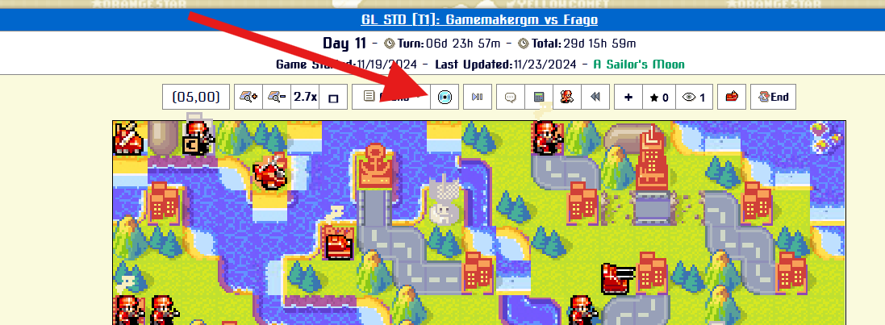
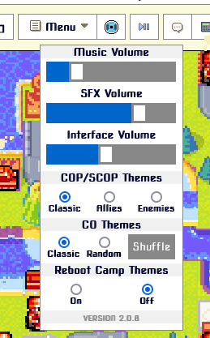
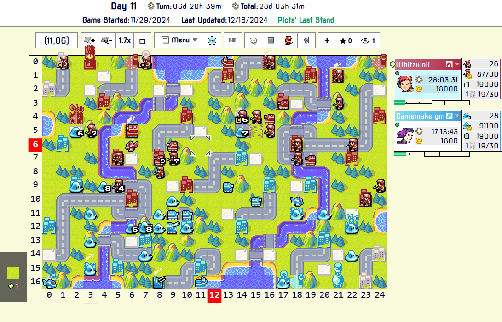

# AWBW Custom User Scripts
This repo contains the code for my custom user scripts for Advance Wars by Web.

The code in this repo is in active development, the latest stable versions can be installed here https://greasyfork.org/en/users/1399453-developerjose

This project is managed with [npm](https://www.npmjs.com/). All code is formatted using [prettier](https://prettier.io) and checked with [ESLint](https://eslint.org/).

I am using [webpack](https://webpack.js.org/) so I can have code across many files and then bundle them into a single userscript, making everything easier to organize and read instead of having a huge single file for each project.

I configured npm to use PowerShell with the command ```npm config set script-shell powershell``` to properly run my npm scripts like ```npm build```.

# File Structure
* **dist/** - Contains all the final bundled userscripts with filenames ending in **.user.js**
* **<SCRIPT_NAME>/** - Source code directory for each script. Each script has a **main.js** file which is the base file used to bundle everything together.
* **.prettierrc** - Configuration for [prettier](https://prettier.io).
* **config.js** - Constants and other project configuration settings that could be used by any scripts.
* **eslint.config.mjs** - Configuration for [ESLint](https://eslint.org/).
* **package.json** - NPM package configuration for this project.
* **webpack.common.js** - Webpack configuration shared by all userscripts which is then merged with each specific script's configuration with [webpack-merge](https://www.npmjs.com/package/webpack-merge).

# Script List
## 1) AWBW Music Player (DeveloperJose Edition)
Directory: **music_player/**

This is a modified version of twiggy_'s original AWBW Music Player 2.0.8 script (https://greasyfork.org/en/scripts/459630-awbw-music-player) with the following changes:
* When a turn change happens, if the next CO is the same as the previous CO the music won't restart.
* If you change the turn with the turn selector checkbox (the one with the numbers) the music will change accordingly as well. Before it only changed the music if you used the turn selector arrows to go forward/backward.





## 2) AWBW Highlight User Coordinates
Directory: **highlight_coordinates/**

Displays and better highlights the coordinates of your cursor by adding numbered rows and columns next to the map in Advance Wars by Web.


