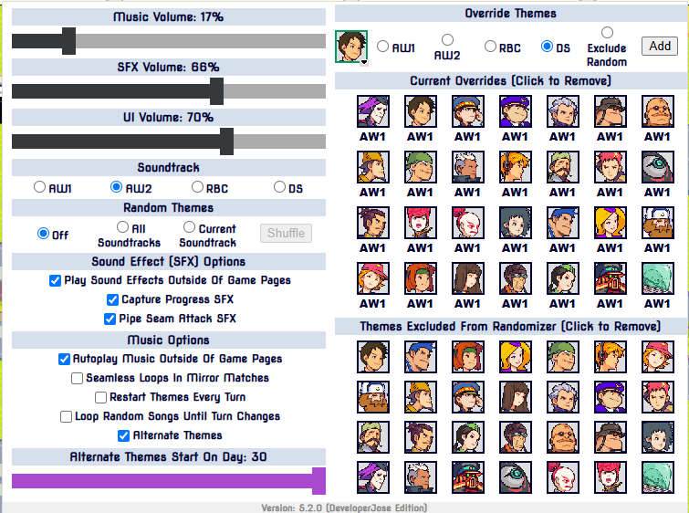
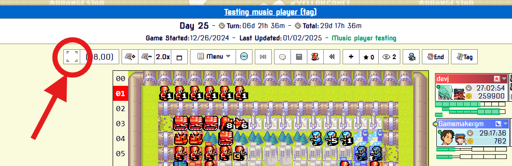

# AWBW Custom User Scripts
This repo contains the code for my custom user scripts for Advance Wars by Web (AWBW) written mainly in [Typescript](https://www.typescriptlang.org/).

If you are a developer, you might be interested in my [AWBW Types File](./shared/awbw_types.d.ts) which although incomplete basically serves as an unofficial API and can be easily extended.

The code in this repo is in active development, the latest stable versions can be installed here https://greasyfork.org/en/users/1399453-developerjose

This project is managed with [npm](https://www.npmjs.com/), all code is formatted using [prettier](https://prettier.io), checked with [ESLint](https://eslint.org/), and documented with [JSDoc](https://jsdoc.app/) conventions and formatting.

I am using [rollup.js](https://rollupjs.org/) so I can modularize code across many files and then bundle them into a single userscript, making everything easier to organize and read when writing code instead of having a huge single file for each project.

# Development Instructions
To build the project simply install the npm dependencies with ```npm install``` and then run the ```npm run package``` to build all the projects in the repo.

I use ```npm run build``` to build a single project in the repo, the one I'm currently focusing on. Feel free to change that in **./package.json** if you'd like.

# File Structure
* **dist/** - Contains all the final bundled userscripts with filenames ending in **.user.js**
* **shared/** - Contains all shared code between all my userscripts. It's basically an unofficial AWBW API. See [./shared/README.md](./shared/README.md) for more information.
* **<SCRIPT_NAME>/** - Source code directory for each script. Each script has a **main.js** file which is the base file used to bundle everything together.
* **.prettierrc** - Configuration for [prettier](https://prettier.io).
* **eslint.config.mjs** - Configuration for [ESLint](https://eslint.org/).
* **package.json** - NPM package configuration for this project.
* **rollup.config.js** - Configuration used to build all scripts with [rollup.js](https://rollupjs.org/).
* **tsconfig.json** - Configuration used for [Typescript](https://www.typescriptlang.org/).

# Script List
## 1. Improved AWBW Music Player
Directory: **music_player/**

Adds a music player to Advance Wars by Web that comes with all the CO themes and game sound effects, just like in the cartridge! Look for the CD icon next to the "Menu" at the gamebar on top of the game map.

This is a major code refactoring and update to twiggy_'s original AWBW Music Player 2.0.8 script (https://greasyfork.org/en/scripts/459630-awbw-music-player). I have rewritten the original code fully in Typescript with some improvements, split the code into modules, and documented everything more in depth.

Below are the changes from the original script:
* Added the option to switch between AW1, AW2, AW:Dual Strike, and AW:Reboot Camp soundtracks. Note that in AW1 there are no special power themes, but the activation sound makes up for it! The Reboot Camp power themes for all COs were added as well.
* You can also add overrides for themes of specific COs. For example, if you really like Sonja's Reboot Camp theme you can add an override for Sonja so that her Reboot Camp theme will play even when your selected soundtrack is AW1/AW2/AWDS.
* Added alternate themes that start after a certain day. If enabled, for example, the Reboot Camp power themes will switch from the CO themes to the factory themes like in the factory campaign missions. There are some other hidden alternate themes, be on the lookout!
* Added sound effects: subs and stealths hiding and unhiding, units getting trapped, loaded missile silos being launched, black bombs exploding, units making progress capturing a property, pipe seams getting attacked (prepare to be surprised), CO and Super CO Power becoming available, Colin's Gold Rush sound effect, COs tag swapping, canceling actions, and trying to buy a unit when you don't have enough funds.
* Each song will continue where it left off the last time it played instead of always starting at the beginning. This means when a turn change happens, if the next CO is the same as the previous CO the music won't restart. Note that this feature is disabled when using the random theme setting.
* Fixed issues where some replay controls weren't updating the music properly.
* Added cursor moving sound effects to design map page. 
* Added music to maintenance page.




## 2. AWBW Highlight Cursor Coordinates
Directory: **highlight_cursor_coordinates/**

Displays and better highlights the coordinates of your cursor by adding numbered rows and columns next to the map in Advance Wars by Web.

To toggle on and off, look for the cursor select icon to the left of the coordinates display box.

Also works on the map editor and on the move planner (hidden by default though).




